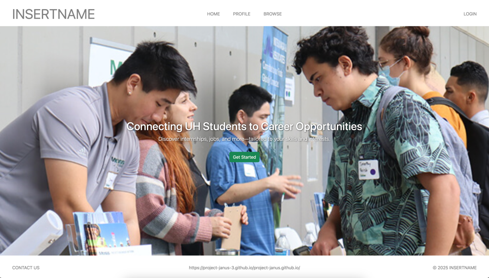
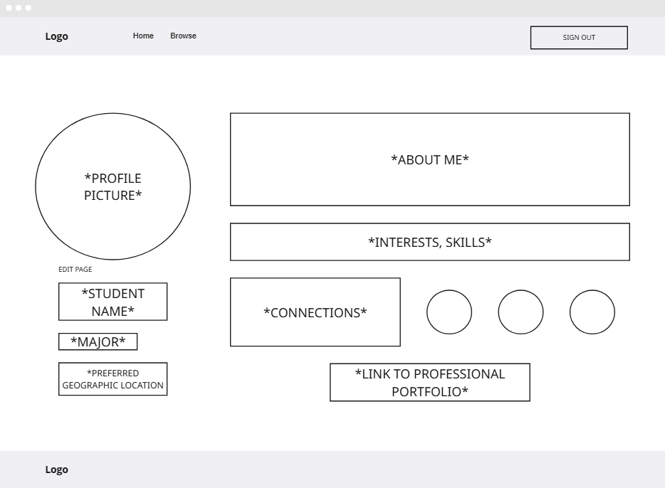
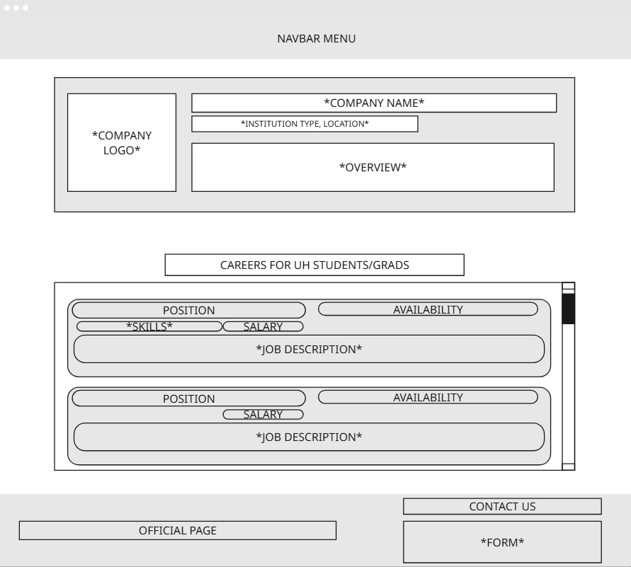
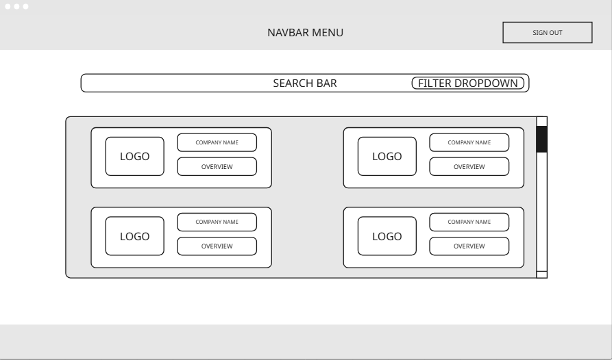
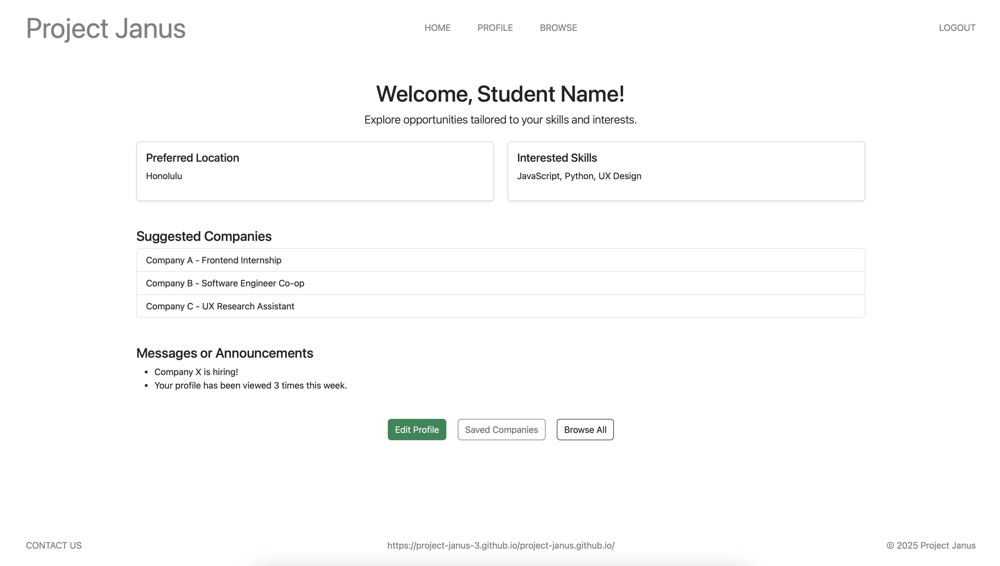

# Project Janus

## Table of contents

* [Overview](#overview)
* [User Guide](#user-guide)
* [Team](#team)

## Overview

Project Janus's main mission is to provide UH computer science and engineering students with a web application that ensures that searching for internship and job opportunities can be as organized and concise as possible. In addition, students will have the immediate opportunity to connect with other students and employers to grow their network.

### Deployment

### Github Organization

[link](https://github.com/project-janus-3)

### Team Contract

[link](https://docs.google.com/document/d/1GqOg4DLsPoxIgjphTprqiRtj9g98ZINV9jkKbhVfkNo/edit?usp=sharing)

## Project Pages

### M1 Project Page

[link](https://github.com/orgs/project-janus-3/projects/2)

### M2 Project Page

[link](https://github.com/orgs/project-janus-3/projects/6)

## User Guide - Mockup Pages

This section provides mockups of different pages for the user interface for the Project Janus application

### Landing Page

The landing page is presented to users when they visit the top-level URL to the site.

### Student Profile Page

This page is the student's profile and shows information about their skills, preferred location, connections, and link to professional portfolio.

### Company Profile

This page show's the company's profile. It includes basic information such as name, location, and a description about them.

The page also provides a list of careers with availability and job description.

### Browsing Page

A simple page to browse through different companies that are affiliated with Project Janus.

### Student Home Page

This page displays the student's basic info, provides suggested companies based on their intrests, and shows important messages or announcemets.

## Team

Project Janus was created by [Isaiah Dela Cruz](https://isaiahdelacruz.github.io/), [Ethan Figart](https://efigart.github.io/), [Danny Ngo](https://danny-ngo-2005.github.io/), and [Royce Jarvy Uy](https://royce-jarvy.github.io/).
