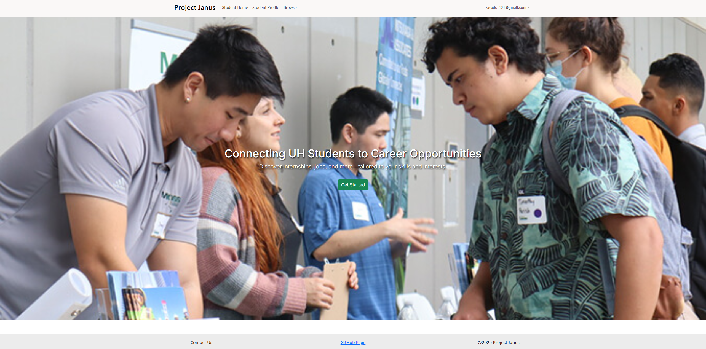
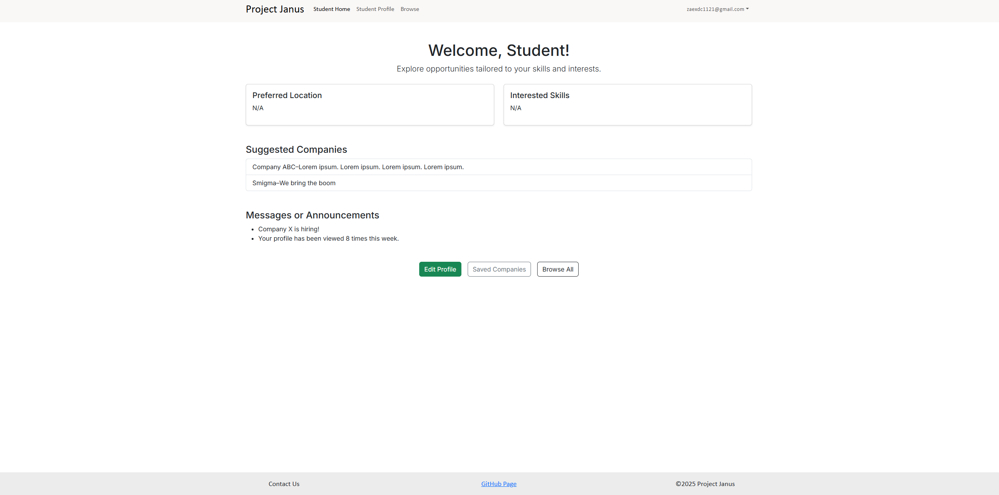
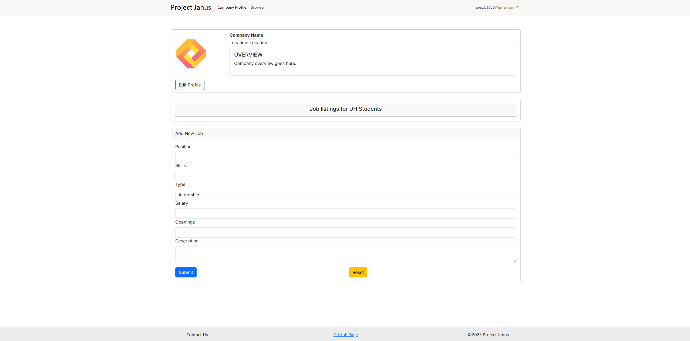
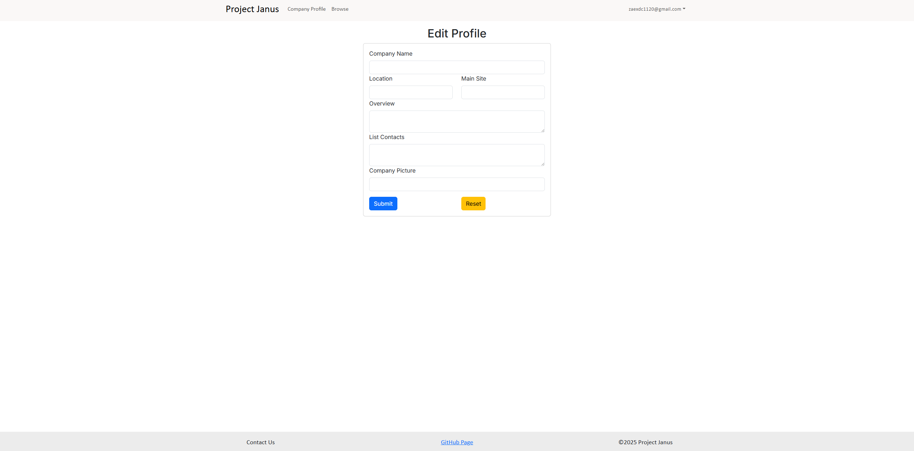
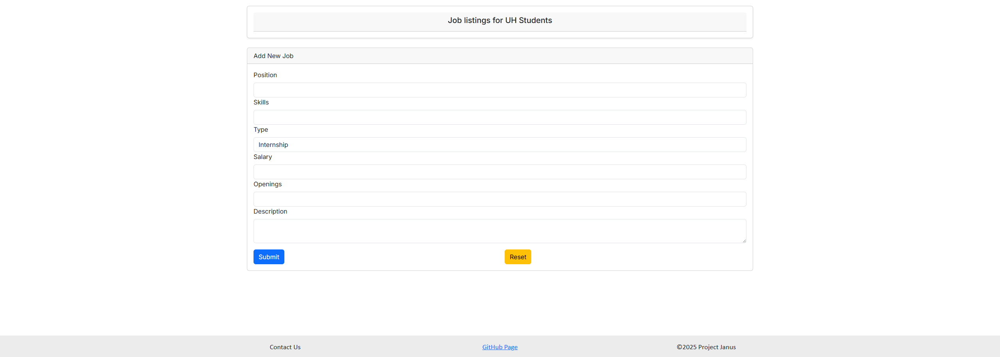
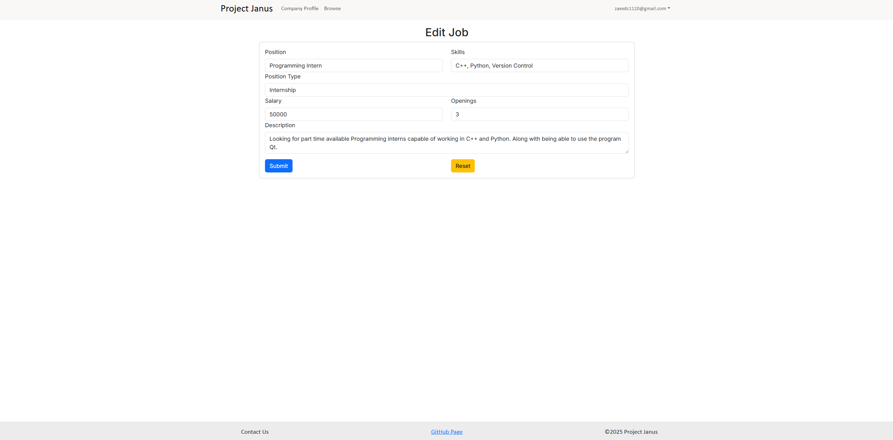

# Project Janus
[](https://github.com/project-janus-3/project-janus/actions/workflows/ci.yml)

## Table of contents

* [Overview](#overview)
* [User Guide](#user-guide)
* [Team](#team)

## Overview

Project Janus's main mission is to provide UH computer science and engineering students with a web application that ensures that searching for internship and job opportunities can be as organized and concise as possible. In addition, students will have the immediate opportunity to connect with other students and employers to grow their network.

### Deployment

Link to the [app](https://project-janus.vercel.app/)

### Github Organization

Access to the Github Organization can be found here: [Github Organization](https://github.com/project-janus-3)

### Team Contract

Access to the Team Contract can be found here: [Team Contract](https://docs.google.com/document/d/1GqOg4DLsPoxIgjphTprqiRtj9g98ZINV9jkKbhVfkNo/edit?usp=sharing)

## Project Pages

### M1 Project Page

Our M1 Project Page can be accessed here: [M1 Project Page](https://github.com/orgs/project-janus-3/projects/2)

### M2 Project Page

Our M2 Project Page can be accessed here: [M2 Project Page](https://github.com/orgs/project-janus-3/projects/7)

### M3 Project Page

Our M3 Project Page can be accessed here: [M3 Project Page](https://github.com/orgs/project-janus-3/projects/9)

## User Guide - Student

### Landing page

The landing page is presented to users when they visit the top-level URL to the site. The 'Get Started' button redirects the user to the sign-in / sign-up page. If the user is already signed in, it redirects them to the home page corresponding to the type of account they have. 



### Student Profile Page

This page is the student's profile and shows information about their skills, preferred location, connections, and link to professional portfolio.


### Student Home Page

This page displays the student's basic info, provides suggested companies based on their intrests, and shows important messages or announcemets. The 'Edit Profile' button redirects the user to the 'User Profile Page'. The 'Browse All' button redirects the user to the 'Browse' Page.



### Browse Page

A simple page to browse through different companies that are affiliated with Project Janus.


## User Guide - Company

### Company Profile Page 

This page show's the company's profile. It includes basic information such as name, location, and a description about them. The page also provides a list of careers with availability and job description.



### Edit Profile Page

This page show's where to edit the company's profile. Here the user can change all fields of the company profile and also reset the fields.



### Add Job Page

This page show's where to add a job listing. It includes fields such as position, skills, type of opening, salary, amount of openings, and the description of the job.



### Edit Job Page

This page show's where to edit a job listing. Here the user can choose to change all fields of the job listing and also reset the fields.



## Mockups

This section provides early mockups of different pages for the user interface for the Project Janus application

### Landing Page

The landing page is presented to users when they visit the top-level URL to the site.


### Student Profile Page

This page is the student's profile and shows information about their skills, preferred location, connections, and link to professional portfolio.


### Company Profile

This page show's the company's profile. It includes basic information such as name, location, and a description about them.

The page also provides a list of careers with availability and job description.


### Browsing Page

A simple page to browse through different companies that are affiliated with Project Janus.

 

### Student Home Page

This page displays the student's basic info, provides suggested companies based on their intrests, and shows important messages or announcemets.


## Developer Guide

This section provides information for developers who want to build off the code base.

* For ease of access, [install GitHub desktop](https://desktop.github.com/download/).
* Visit the [Project Janus repository](https://github.com/project-janus-3/project-janus). Click the green button labeled "Code" and from the dropdown, press "Open with GitHub Desktop" to clone to your repository.
* From your workspace, change into the app/ directory of the cloned repository (via Terminal, etc.) and install the libraries by running:

```
$ npm install
```

* Once finished, you should be able to access the application by running:
```
$ npm run dev
```

* A link should pop up to http://localhost:3000 - The application should be displayed there.

## Community Feedback

We are intrested in your expirence using Project Janus! If you would like, please take a couple of minutes to fill out the [Project Janus Feedback Form](https://docs.google.com/forms/d/e/1FAIpQLSfAI9DCwE6x5gdz6fo2SrTYMApu4G3tktQeBigOvmJ6uvx4yQ/viewform). It contains only 5 short questions and will help us understand how to improve the system.

Based on the feedback we recieved, we  think this version of the app is sucessful, however, there are still ways we can improve. Some users pointed out the simplicity and ease of use of the website. One of our intentions was to make the navigation of the webiste straight-forward. The first thing the user sees when they open the webiste is the landing page: it gives a breif statement about the purpose of our project and includes a button to help the user get started. The navbar at the top of the screen is also very simple, it is custom-taioled to each user group (user / company / admin). This ensures that all the important information is directly accessible to the user. Another positve feedback we recieved was about the browse page, some users commented that the layout made it easy to explore all the different companies. They suggested that we add a search bar, or a way to sort / filter the companies, we think this is a great idea, and will be working to implement it in the future. Moving on, we recieved some contructive feedback on the functionality of the website. Some users reported that they had trouble with signing-up. This was a known issue as we were working on the project, we were (hopefully) able to resolve it. Another user reported that the loading time between pages was long, or that they had to press a button more than one time for it to work. We think this is a Vercel related issue, with future updates, we hope to make the expirence more smooth. Additonally, we hope to add a feature that lets students connect companies, or each other (similar to Linkedin). This would allow direct interaction between students and company recruiters, eliminating the need for extrenal communication. It could also allow students to talk between themselves, they could share companies they have intrest in or even discuss interview tips. Overall, we are happy with the current version of our webiste, this additoinal feedback will help us improve and polish the wbeiste in the future. 

## Team

Project Janus was created by [Isaiah Dela Cruz](https://isaiahdelacruz.github.io/), [Ethan Figart](https://efigart.github.io/), [Danny Ngo](https://danny-ngo-2005.github.io/), and [Royce Jarvy Uy](https://royce-jarvy.github.io/).


