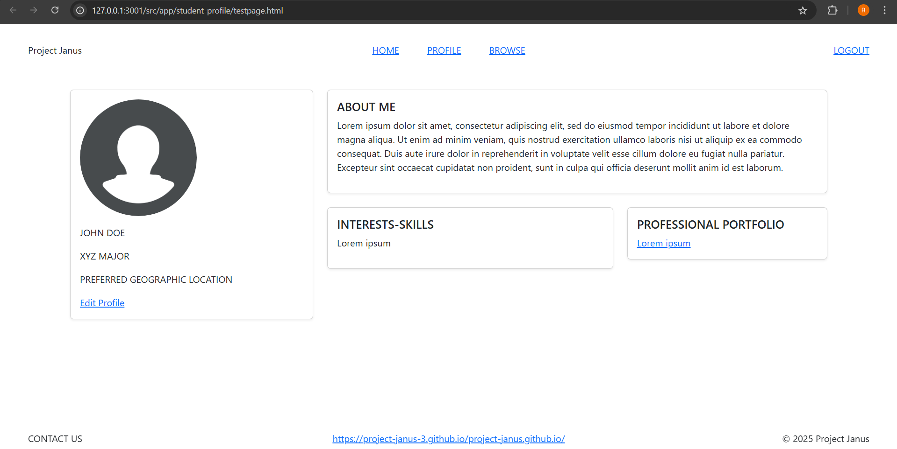
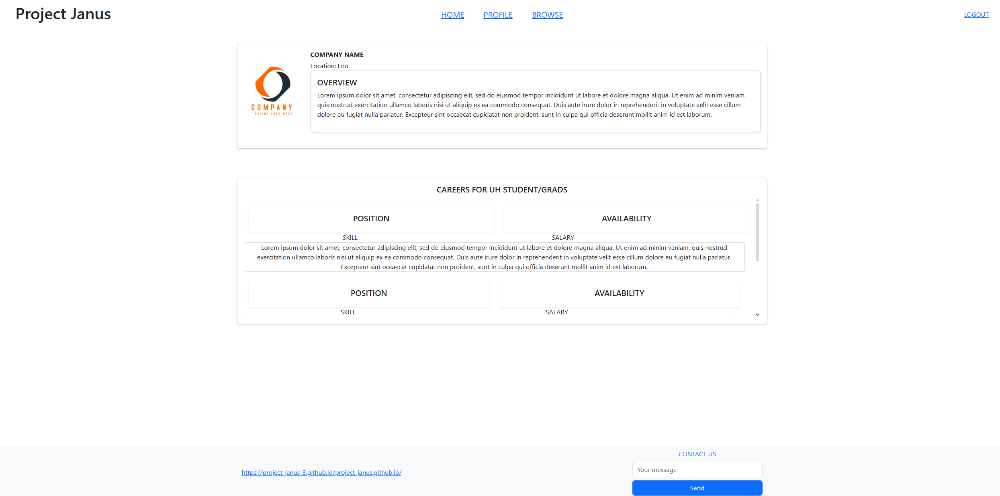
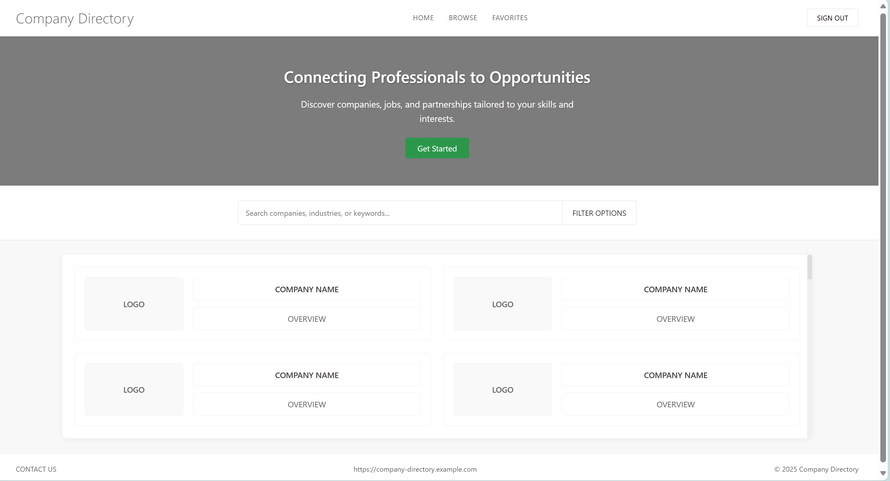
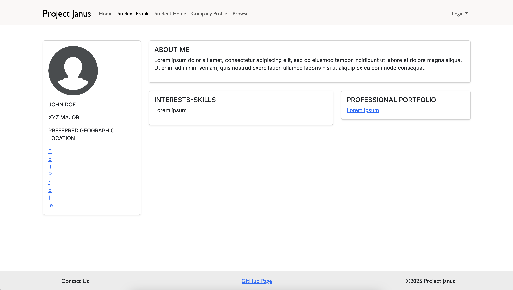
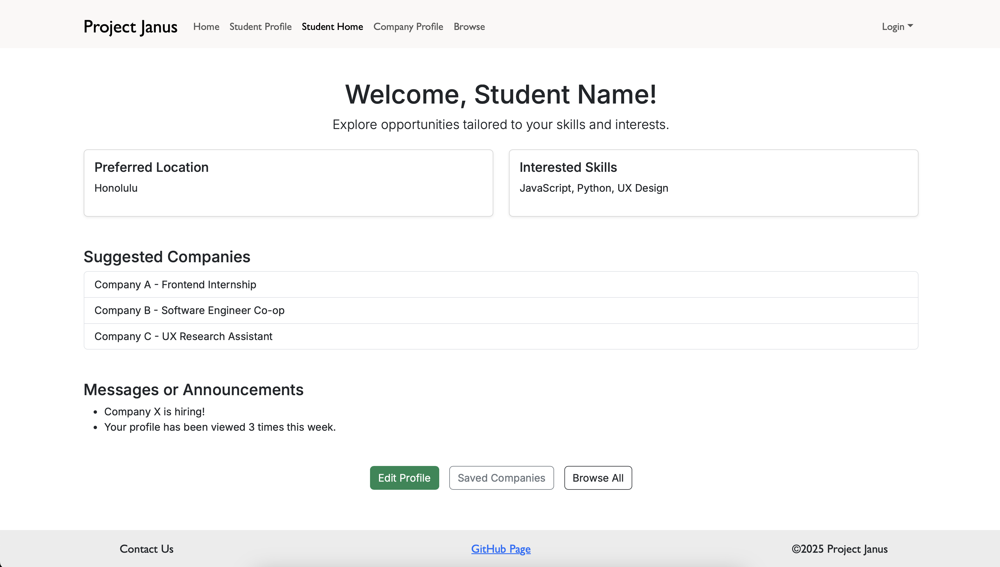
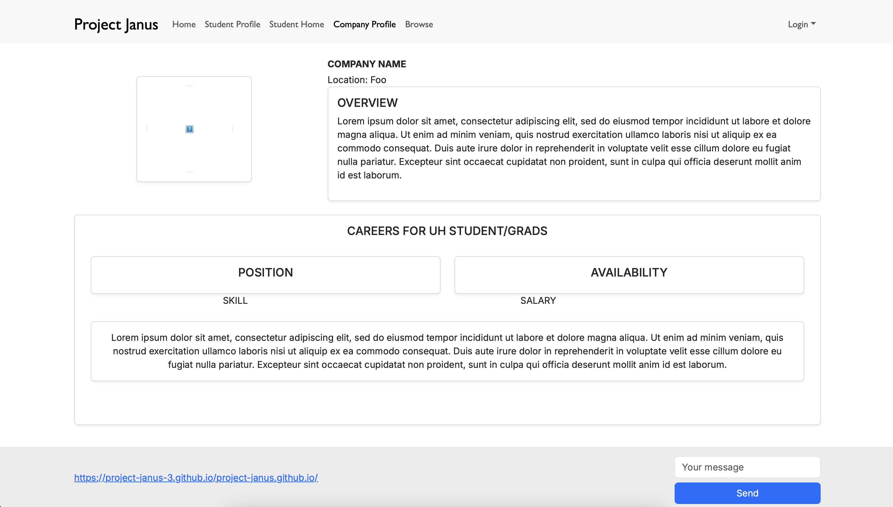
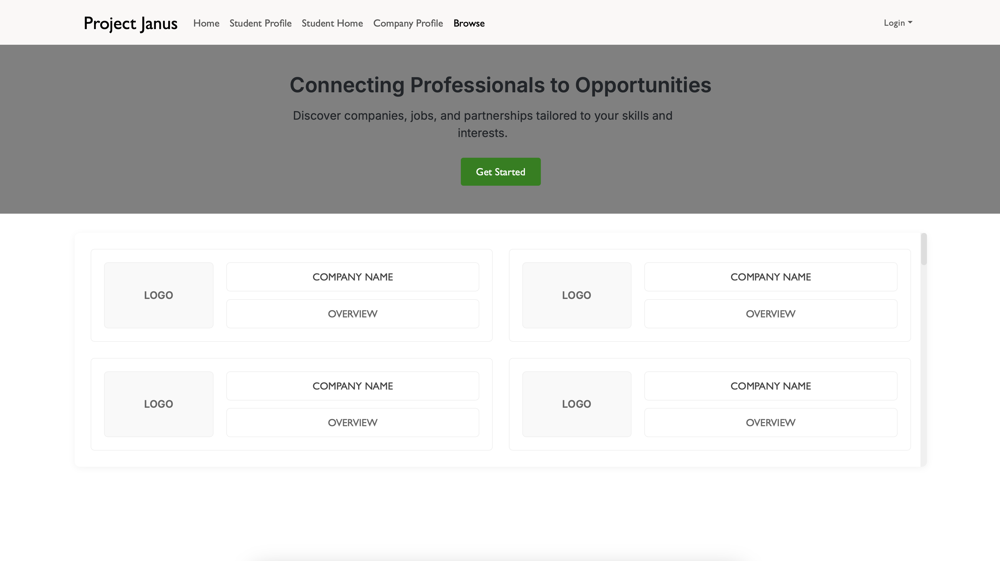

# Project Janus
[](https://github.com/project-janus-3/project-janus/actions/workflows/ci.yml)

## Table of contents

* [Overview](#overview)
* [User Guide](#user-guide)
* [Team](#team)

## Overview

Project Janus's main mission is to provide UH computer science and engineering students with a web application that ensures that searching for internship and job opportunities can be as organized and concise as possible. In addition, students will have the immediate opportunity to connect with other students and employers to grow their network.

### Deployment

Link to the [app](https://project-janus.vercel.app/)

### Github Organization

Access to the Github Organization can be found here: [Github Organization](https://github.com/project-janus-3)

### Team Contract

Access to the Team Contract can be found here: [Team Contract](https://docs.google.com/document/d/1GqOg4DLsPoxIgjphTprqiRtj9g98ZINV9jkKbhVfkNo/edit?usp=sharing)

## Project Pages

### M1 Project Page

Our M1 Project Page can be accessed here: [M1 Project Page](https://github.com/orgs/project-janus-3/projects/2)

### M2 Project Page

Our M2 Project Page can be accessed here: [M2 Project Page](https://github.com/orgs/project-janus-3/projects/7)

### M3 Project Page

Our M3 Project Page can be accessed here: [M3 Project Page](https://github.com/orgs/project-janus-3/projects/9)

## User Guide 

This section provides mockups of different pages for the user interface for the Project Janus application

### Landing Page

The landing page is presented to users when they visit the top-level URL to the site.


### Student Profile Page

This page is the student's profile and shows information about their skills, preferred location, connections, and link to professional portfolio.



### Company Profile

This page show's the company's profile. It includes basic information such as name, location, and a description about them.

The page also provides a list of careers with availability and job description.



### Browsing Page

A simple page to browse through different companies that are affiliated with Project Janus.

 

### Student Home Page

This page displays the student's basic info, provides suggested companies based on their intrests, and shows important messages or announcemets.


## User Guide - Implemented Functionality

### Landing page

The landing page is presented to users when they visit the top-level URL to the site. The 'Get Started' button redirects the user to the sign-in / sign-up page. If the user is already signed in, it redirects them to the home page corresponding to the type of account they have. 


### Student Profile Page

This page is the student's profile and shows information about their skills, preferred location, connections, and link to professional portfolio.



### Student Home Page

This page displays the student's basic info, provides suggested companies based on their intrests, and shows important messages or announcemets. The 'Edit Profile' button redirects the user to the 'User Profile Page'. The 'Browse All' button redirects the user to the 'Browse' Page.



### Company Profile Page 

This page show's the company's profile. It includes basic information such as name, location, and a description about them. The page also provides a list of careers with availability and job description.



### Browse Page

A simple page to browse through different companies that are affiliated with Project Janus.



## Developer Guide

This section provides information for developers who want to build off the code base.

* For ease of access, [install GitHub desktop](https://desktop.github.com/download/).
* Visit the [Project Janus repository](https://github.com/project-janus-3/project-janus). Click the green button labeled "Code" and from the dropdown, press "Open with GitHub Desktop" to clone to your repository.
* From your workspace, change into the app/ directory of the cloned repository (via Terminal, etc.) and install the libraries by running:

```
$ npm install
```

* Once finished, you should be able to access the application by running:
```
$ npm run dev
```

* A link should pop up to http://localhost:3000 - The application should be displayed there.

## Community Feedback

We are intrested in your expirence using Project Janus! If you would like, please take a couple of minutes to fill out the [Project Janus Feedback Form]([https;//](https://docs.google.com/forms/d/e/1FAIpQLSfAI9DCwE6x5gdz6fo2SrTYMApu4G3tktQeBigOvmJ6uvx4yQ/viewform)). It contains only 5 short questions and will help us understand how to improve the system.

## Team

Project Janus was created by [Isaiah Dela Cruz](https://isaiahdelacruz.github.io/), [Ethan Figart](https://efigart.github.io/), [Danny Ngo](https://danny-ngo-2005.github.io/), and [Royce Jarvy Uy](https://royce-jarvy.github.io/).


